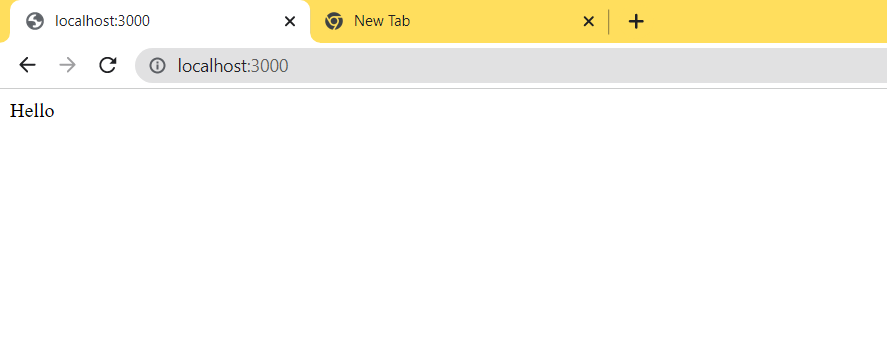

## RESTful API

# What is API

- API stands for Application Programing Interface

- APIs act as a mediator between the two applications to transfer the information between them

-An API is basically a set of rules/protocols which sends a request to a database and retrieves data from it.

- The same mechanism can be explaoned in terms of most famous client and server architecture.

- The language that client and servers speak to send request and get response are HTPP or FTP etc.

- HTTP stands for Hyper Text Transfer Protocol and we might also heard of somethin called as HTTPS here S stands for Secure

- Now that we understand client sends request to database to get whatever it wants to but servers can only do some specific task beyond its control it contacts database to grab the information that client want

- Server can do only certain amount of things beyond which it gets the data from database .Menu of things that server can offer to client in the form of API

- REST is an architectural style for designing the APIS and we have other architectures as well like SOAP,GrapQL,FALCOR

- REST stands for REpresentational State Transfer.

- How exactly do we make our apis RESTful well there are alot of rules outthere but the two important ones

  1.Use HTTP Request Verbs

  2.Use Specific Pattern of Routes/Endpoint URLS

- HTTP Request Verbs

  1.GET

  2.POST

  3.PUT

  4.PATCH

  5.DELETE

- Specific Pattern of Routes/Endpoints
- You might have seen the "/something" while browsing the internet and if you want to go to some perticular place we need to give its name after "/" it is only called as route if we have only "/" it is called as root route.

## Set Up The Basic Server

- initialize the npm inside our project by executing the below command
- `npm init -y`
- second we need to install the express(a nodejs framework) inside our folder where we initialized the npm.
- create `app.js` file inside the folder.
- Next we need to import or `require` express inside the `app.js` and assign it to the `const app` because we can easily use it latter inside our project

- install the package called as `nodemon` as dev dependencies to restart the server automatically whenever we make changes to the source code

- To see the output we first need to listen on the certain ports in the browser for that we need to use
  `app.listen(port,function(req,res){console.log(`server started on port ${PORT}`)})`

- To check the output we need to setup the basic home route "/"
  `app.get("/",function(req,res) {res.send("Hello")})`

- In the `package.json` give the below `key:value` inside the `scripts` object

  - `"start": "nodemon app.js"`

- In the terminal give the command `npm start` to start the server at port number 3000 you can see the output inside the browser.

## Connecting to Database

- Remember in the previous section i mentioned servers can't do all of the things they fetch the information from the `database` .

- In this project i am using mongodb as the database for storing the information.

- We need to install `mongoose` mongoose is the Object Data Modeling(ODM) library for MongoDB and Node.js.

- `npm i mongoose`

- Create the connection to the database by `require` the mongoose inside the `app.js` file

- And we need to create the schema for our database and model around the schema to do that create folder called `model` and create a `database.js ` file to create schema inside it.

- Export the model created in the `database.js` file using `module.exports=model name` and import it inside the `app.js` file

- If you start the server it might give error make sure to run the `mongod` command in another terminal to start the server.

## CRUD Operations

### GET all articles from wikiDB it is R(READ) in CRUD

- To get all the articles stored in the `wikiDB` database we need to write the `get` method to fetch from the database at the route `/articles`

### POST one article to the database it is C(CREATE) in CRUD

- To add the article to the database we need to write `post` method to the database as mentioned in the `app.js`.

- To post the the data from the browser easy not easy so we are using tool called as `POSTMAN` that makes our life easier.

### DELETE all the articles in the wikiDB it is D(DELETE) in CRUD

- To DELETE The articles or any other data from database we need to write
  `delete` method and include below query inside the callback function.

- `<model name>.deleteMany(function(err){})`.

### Chained route

- We can chain the all the `get() put() post() delete()` to the perticular route so that we can make reduce code redudancy

- For example `app.route('/routeName').get().put().post().delete().patch()`.

### CRUD to perticular article

- For GET operation we need to give the below mongoose query
  `<model name>.find({condition},function(){})`

- For PUT operation we need to give the below mongoose query
  `<model name>.update({condition},{content},function(err){} )`

- For PATCH operation we need to give the below mongoose query
  `<model name>.update({condition},{$set:content},function(err){})`

- For DELETE operation we need to give the below mongoose query
  `<model name>.findOneAndDelete({condition},function(err){})`
